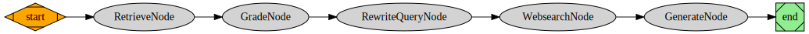

# LangChain4j Corrective RAG

## Overview

Welcome to `langchain4j-corrective-rag`, a powerful library that bring [Corrective-RAG (CRAG) paper](https://arxiv.org/pdf/2401.15884.pdf) to life in your Java applications. CRAG is a unique strategy for RAG that integrates self-reflection and self-grading on retrieved documents. It's a process that's as dynamic as it is intelligent, taking some steps to ensure the most relevant information is used for final answer generation.


This RAG lib is built on top of the `langchain4j-workflow` and `langchain4j` libraries,  which allow you to use your own data, chat language models, web search engine, vector store and others to create a GenAI java app supported with CRAG-based. 

With `langchain4j-corrective-rag`, implementing CRAG is as easy as defining your documents, setting up a chat language model, defining a web content retriever, and creating a CorrectiveRag instance. It's designed to make your journey with CRAG as smooth as possible, allowing you to focus on your data and AI technologies.

## How it Works

1. If at least one document surpasses the relevance threshold, the system proceeds to generation.
2. Before generation, it performs knowledge refinement, partitioning the document into "knowledge strips".
3. Each strip is graded, and the irrelevant ones are filtered out.
4. If all documents fall below the relevance threshold or if the grader is uncertain, the system seeks an additional data source, supplementing retrieval with web search.

## How to Use

`langchain4j-corrective-rag` is a library that provides an easy way to implement CRAG in your Java applications. Here are the steps to get started:

1. **Define your `Document`s**: These are the documents that the system will search for answers. You can use your own data here.

2. **Define a `ChatLanguageModel`**: This is the model that will generate answers. You can use any chat language model that you prefer.

3. **Define a `WebContentRetriever`**: This component will search the web for additional answers when needed.

4. **Create a `CorrectiveRag` instance**: This is the main component that brings everything together. You can use the `DefaultCorrectiveRag` implementation to create a CRAG instance.

In addition to these basic steps, `DefaultCorrectiveRag` implementation also provides several optional args for more advanced use cases:

- **`EmbeddingStoreContentRetriever`**: This is an optional component that you can use to search for answers using your own `EmbbedingStore` and `EmbbedingModel`. By default, `DefaultCorrectiveRag` create an instance of `EmbeddingStoreContentRetriever` using `InMemoryEmbeddingStore` and `BgeSmallEnV15QuantizedEmbeddingModel`. However, for better performance or production environments, we recommend set your own `EmbeddingStoreContentRetriever`.

- **Stream Flag**: This optional flag enables streaming the workflow node by node. By default, it is set to false.

- **GenerateWorkflowImage Flag**: This optional flag allows you to generate a workflow image using Graphviz default settings. By default, it is set to false.

- **WorkflowImageOutputPath**: This optional setting allows you to save the workflow image to a given path. By default, it is null. If it is set, and the `generateWorkflowImage` flag is set to true, the system will save the workflow image to the given path.

## Example

Here is a simple example of how to use the `langchain4j-corrective-rag` module:

```java
// 1- Index document content
List<Document> documents = loadDocuments(
        "https://lilianweng.github.io/posts/2023-06-23-agent/",
        "https://lilianweng.github.io/posts/2023-03-15-prompt-engineering/",
        "https://lilianweng.github.io/posts/2023-10-25-adv-attack-llm/"
);

// 2 - Define a chatLanguageModel
ChatLanguageModel llm = MistralAiChatModel.builder()
        .apiKey(System.getenv("MISTRAL_AI_API_KEY"))
        .modelName(MistralAiChatModelName.MISTRAL_LARGE_LATEST)
        .temperature(0.0)
        .build();

// 3 - Define a webContentRetriever
WebSearchContentRetriever webRetriever = WebSearchContentRetriever.builder()
        .webSearchEngine(TavilyWebSearchEngine.builder().apiKey(System.getenv("TAVILY_API_KEY")).build())
        .maxResults(3)
        .build();

// 4 - Create a CorrectiveRag instance
CorrectiveRag correctiveRag = DefaultCorrectiveRag.builder()
        .documents(documents) 
        // OR
        //.embeddingStoreContentRetriever(contentRetriever) // Optional, by default it uses InMemoryEmbeddingStore and BgeSmallEnV15QuantizedEmbeddingModel
        .webSearchContentRetriever(webRetriever)
        .chatLanguageModel(llm)
        //.stream(true) // Optional, by default it is false, if true it will stream the workflow node by node
        //.generateWorkflowImage(true) // Optional, by default it is false, if true it will generate a workflow image using Graphviz default settings
        //.workflowImageOutputPath(Paths.get("corrective-rag-workflow.png")) // Optional, by default it is null. If it is set, it will save the workflow image to the given path and generateWorkflowImage is set to true
        .build();

// Run the CorrectiveRag instance
String question = "How does the AlphaCodium paper work?";
String answer = correctiveRag.answer(question);
```
Final answer should be:

```shell
INFO: Final Answer:
The AlphaCodium method for code generation operates in two main phases. In the pre-processing phase, the model reasons about the problem in natural language, gaining knowledge and insight to help with more difficult stages. 
The second phase is an iterative code generation phase, where the model generates, runs, and fixes a code solution against public and AI-generated tests. This approach is designed to improve the performance of large language models on code problems by focusing on details, identifying edge cases, and addressing code-specific issues.
```
If generateWorkflowImage is set to `true`, the system will generate an image of the workflow execution. Here is an example of the workflow image generated for the above example:

> **Remember**: The documents ingested do not talk about the AlphaCodium paper, so the system will search the web for additional documents.




Enjoy!

@c_zela
